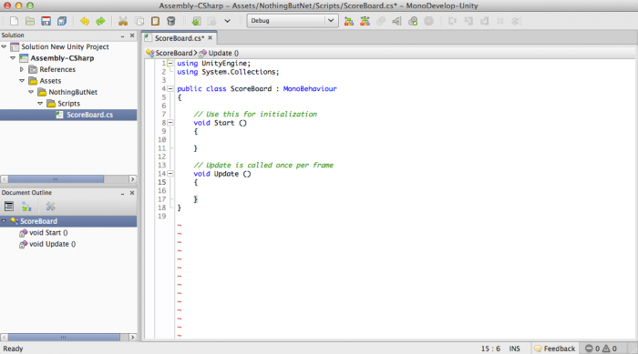
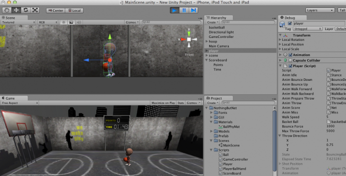

# Unity 3D中级教程：iOS篇－第2/3篇

欢迎回到我们的Unity 3D iOS中级系列教程。

在这个系列教程里，你会学习如何用Unity制作一个叫做“Nothing but Net”的简单3D游戏。在教程的第一部分，你已经学到以下Unity概念：
- Unity 3D的界面
- Assets
- 材质与贴图
- 场景位置
- 光照
- 摄像机位置
- 物理与碰撞体
- Prefabs

你的场景中的每一样东西看上去都很棒，但是到目前为止你做的所有事情都是通过Unity的可视化场景编辑器实现的。换句话说，你还一行代码没写！

现在是时候改变了：）在教程的这一部分，你会开始通过代码向游戏中加入生机，并且向场景加入一些交互和动画。

本教程接着前一教程结束的地方继续。如果你觉得都掌握好了想马上开始，可以使用这个[上一教程结束时的项目文件](http://cdn5.raywenderlich.com/downloads/NBN_Part1_Complete.zip)。在Unity的File\Open Project，点击Open Other，定位到文件夹即可打开。注意场景不会被默认加载——要打开的话，选择Scenes\GameScene。

让我们开始吧！

## 确保所有人都很好的跟上节奏
在你深入研究代码之前，先很快的过一眼下面的图表，它标出了你将要加入到游戏中的每一个部件的功能与职责，以及这些部件之间的关系：


在中心的是**GameController**。这是一个抽象的**GameObject**，即不与舞台上的任何一个物理元素相关联，而是用来管理场景。在这个例子中**GameController**负责根据用户输入来协调游戏活动的各种状态。

下一个**部件**是**ScoreBoard**。它包含了方法来更新场景里的**分数**和**时间3D文本GameObjects**。

再下一个是**Player**，负责响应用户输入，并且管理球的各种参数，包括位置信息。

最后，你的游戏没有**Ball**怎么行呢？这个对象负责在**Ball**穿过篮网以及落在地面时触发特定事件，表明玩家当前回合结束。

## 脚本，脚本，脚本
Unity提供了若干不同脚本语言可供选择；包括Boo（不，我不是在吓你，这[真是一种语言](http://boo.codehaus.org/)），Javascript（也就是UnityScript）以及C#。通常来说，如果你之前是做前端网页开发出身，那么UnityScript也许是最好的选择。

不过，如果你更熟悉C++，Java，Objective-C或者C#，那么C#对你的脚本编写任务而言就更合适。考虑到本网站的大部分读者都有Objective-C的背景，在本教程中你将用C#来写脚本。

每一个脚本都是一个**部件**，会被挂到一个**GameObject**上面。你的代码需要从**MonoBehaviour**这个基类继承，它包含了一整套预定义属性，方法以及钩子。

```
注意：你可能在思考“钩子”是什么意思。钩子就是当特定事件发生时，会传播给所有部件的回调或者消息，例如我们会用到的一个OnTriggerEnter方法，就会在两个碰撞体互相相交的时候被调用（Is Trigger标志需要被设为true，稍后详述）。
```

让我们试试！在**Project**面板，选择**Scripts**文件夹，点击**Create**，然后点击**C# Script**：


在Inspector中，你可以看到默认脚本已经为你自动生成，看上去大概是这样：
```
using UnityEngine;
using System.Collections;
 
public class DummyScript : MonoBehaviour {
 
    // 在这里初始化
    void Start () {
 
    }
 
    // Update会在每帧调用
    void Update () {
 
    }
}
```

这里的Start()和Update()方法就是钩子方法；他们会被游戏引擎在每一帧更新的时候调用，也被称为tick（译者注：Start只会在Update首次被调用前调用，和Awake一样只被调用一次）。游戏引擎的一个核心行为就是持续不断的更新以及渲染循环。一个对象被移动，然后场景重新渲染。这个对象再移动，然后场景再一次的被渲染。如此往复。

当一个**部件**被一开始创建出来的时候，Awake()（此处未列出，但你可以重写）会被调用。一旦所有active**部件**的Awake()方法被调用完毕，则轮到Start()方法被调用。然后是Update()方法，它会在每一帧更新或者说tick时调用。

```
注意：MonoBehaviour还有一个更新方法叫做FixedUpdate()。这个方法是被物理引擎调用的，并且应该只被用来更新刚体或者其他基于物理的属性。它被称为FixedUpdate是因为它保证在固定间隔时间后调用，而不像Update()方法那样，因为是每一个tick都被调用，两次调用中间相差的时间可能会不同。
```

## ScoreBoard
我们先从最简单的**ScoreBoard**脚本开始。你已经创建了脚本文件，所以只用将它改名成**ScoreBoard**，然后双击打开即可。

啊哈，我打赌你还不知道Unity自带MonoDevelop！


```
注意：MonoDevelop是一个完整的C#集成开发环境，详细展开讨论它的特性和功能已经不属于本教程讨论范围。不过如果你只是用它来编辑和保存文本，也能就这样完成工作。如果你还想使用更高级的特性，你可以在[MonoDevelop](http://www.monodevelop.com)找到更多内容。
```

将以下代码插入到新脚本中：
```
using UnityEngine;
using System.Collections;
 
public class ScoreBoard : MonoBehaviour
{        
 
    public TextMesh pointsTextMesh;
    public TextMesh timeRemainingTextMesh;
 
    void Awake ()
    {       
    }
 
    void Start ()
    { 
    }
 
    void Update ()
    {    
    }
 
    public void SetTime (string timeRemaining)
    {
        timeRemainingTextMesh.text = timeRemaining;     
    }
 
    public void SetPoints (string points)
    {
        pointsTextMesh.text = points;   
    }   
}
```

上面的脚本引入了概念：可访问的公共属性。在这个例子中，ScoreBoard对象的孩子**分数**和**时间3D文本**就是这样的属性。

将这些属性弄成公共的意味着他们将在**Inspector**面板可见，这就让你可以在设计的时候通过编辑器直接给他们赋值。只要这些属性被赋了值，你就能通过设置方法SetTime()和SetPoints()来修改他们的**text**属性。

一旦你创建好以上脚本，切换回Unity并将其挂到**ScoreBoard**对象上面。具体做法是将脚本对象拖拽到Scoreboard对象上即可。

接下来将教程第一部分里创建的每一个**3D文本**子对象拖到右边面板中合适的属性槽，如下图所示：


这样就把**3D文本**子对象与脚本属性联系了起来。非常简单不是吗？

## 测试时间
在继续下去之前，让我们确保所有的一切都正常工作。为了做到这一点，我们要创建一个新的脚本，用来更新你的记分牌上的时间和分数。创建一个叫**ScoreboardTest**的新脚本，并将以下代码复制进去：
```
using UnityEngine;
using System.Collections;
 
public class ScoreBoardTest : MonoBehaviour
{        
 
    public ScoreBoard scoreboard; 
 
    public void Start()
    {
        scoreboard.SetTime( "60" );
        scoreboard.SetPoints( "100" );
    }
 
}
```

然后点击**GameObject\Create Empty**，将对象改名为**ScoreboardTest**，并将你的ScoreBoardTest脚本挂上去（还是直接拖上去即可）。然后将场景里的scoreboard GameObject连到ScoreBoardTest的scoreboard变量上，并点击play。


可以工作了——你应该看到记分牌上的文本变成像上面这张截图一样。如果没有，从头检查每一个步骤看看哪里可能出了问题。

## 控制碰撞
现在是时候来看看Unity是怎么处理对象碰撞的了。

回忆一下，Ball对象是负责在自己入网并且/或者落地时通知**GameController**的。这个Ball对象是绑在一个**球状碰撞体(SphereCollider)**以及**刚体(Rigidbody)**上的，这让你可以检测碰撞并对此作出反应。在你的脚本里，你可以监听这些碰撞事件，并正确的通知**Game Controller**。

就像你之前做的那样，创建一个新的脚本并命名为**Ball**。然后在MonoDevelop里面编辑如下代码：
```
using UnityEngine;
using System.Collections;
 
[RequireComponent (typeof(SphereCollider))]
[RequireComponent (typeof(Rigidbody))]
public class Ball : MonoBehaviour
{
 
    private Transform _transform;
    private Rigidbody _rigidbody;
    private SphereCollider _sphereCollider; 
 
    public delegate void Net ();
 
    public Net OnNet = null;
    private GameController _gameController;
 
    void Awake ()
    {
        _transform = GetComponent<Transform>();
        _rigidbody = GetComponent<Rigidbody>();
        _sphereCollider = GetComponent<SphereCollider>();
    }
 
    void Start ()
    {         
        _gameController = GameController.SharedInstance;
    }
 
    void Update ()
    {
 
    }
 
    public Transform BallTransform {
        get {
            return _transform; 
        }   
    }
 
    public Rigidbody BallRigidbody {
        get {
            return _rigidbody;  
        }
    }
 
    public SphereCollider BallCollider {
        get {
            return _sphereCollider;     
        }
    }
 
    public void OnCollisionEnter (Collision collision)
    {
        _gameController.OnBallCollisionEnter (collision);
    }
 
    public void OnTriggerEnter (Collider collider)
    {
        if (collider.transform.name.Equals ("LeftHoop_001")) {
            if (OnNet != null) {
                OnNet ();    
            }   
        }
    }
}
```

```
注意：因为对象和**GameController**之间的依赖关系，很多要用到的方法需要先写一个只有函数签名的空占位符，稍后再给出具体实现。在这个例子中，实例方法OnBallCollision与类方法SharedInstance()都已经准备好了占位函数。
```

下面我们来逐块看看这段脚本里引入的新概念：
```
[RequireComponent (typeof (SphereCollider))]
[RequireComponent (typeof (Rigidbody))]
```

Unity提供了类属性，让你可以给你的类增加设计时的逻辑。在这个例子里，这段代码就是告诉Unity这个脚本的依赖关系，它需要**SphereCollider**和**RigidBody**部件也挂在上面。

这是一个良好的习惯，特别是当你的项目越来越大的时候，它提供了一种方式来自动挂上你的脚本依赖的**部件**，以避免不必要的bug。

```
private Transform _transform;
private Rigidbody _rigidbody;
private SphereCollider _sphereCollider; 
 
void Awake ()
{
    _transform = GetComponent<Transform>();
    _rigidbody = GetComponent<Rigidbody>();
    _sphereCollider = GetComponent<SphereCollider>();
}
```

GetComponent()方法是从MonoBehavior类继承而来的，它提供了在自己所挂GameObject上寻找指定部件类型的途径。如果没有这个部件则返回null，否则返回这个部件。因为它需要遍历这个GameObject的所有部件，因此如果需要经常访问，最好是将结果在本地缓存起来（比如当你需要在Update()或者FixedUpdate()里使用它们的时候）。

```
private GameController _gameController; 
 
void Start () {			
    _gameController = GameController.SharedInstance; 
}
```

这个对象需要一个指向Game Controller的引用，这样才能在诸如碰撞事件发生时通知到它。Game Controller会做成单例对象，然后你可以通过静态属性SharedInstance来访问它。

```
public delegate void Net();
public Net OnNet = null;
```

如果你没用过C#，可能对delegate和event不太熟悉。基本上，它们提供了一种方法来让部件之间进行交流。在这个例子里，外部的部件可能会注册表示对OnNet事件感兴趣，这么做之后，当Ball的脚本发出OnNet事件时，它就会被更新到(观察者模式的实现)。这个概念其实和iOS编程里用到的委托模式很相似。

```
public void OnCollisionEnter( Collision collision ){
    _gameController.OnBallCollisionEnter( collision );
}
```

Ball的主要任务是当球每次过网以及/或者落地的时候通知GameController。因为Ball上挂有Rigidbody脚本，当它与Ground对象的BoxCollider部件发生碰撞时，物理引擎会通过OnCollisionEnter()方法发送通知。

传入的Collision参数存放了关于碰撞的具体信息，包括Ball是与谁发生了碰撞。在这个例子里，你只需要把具体信息传给GameController来判断下一步要怎么做即可：）

```
注意：除了OnCollisionEnter()之外，还有OnCollisionStay()方法以及OnCollisionExit()方法，前者会在对象与别的物体发生碰撞期间的每一帧调用，后者会在碰撞结束时调用。更多信息可参看Unity的[官方文档](http://docs.unity3d.com/Documentation/ScriptReference/MonoBehaviour.html)。
```

```
public void OnTriggerEnter( Collider collider ) {
    if( collider.transform.name.Equals ( "LeftHoop_001" ) ) {
        if( OnNet != null ){
            OnNet(); 	
        }	
    }		
}
```

以上代码用于检测球是否过网。还记得在上一教程里，你是如何在网的正下方设置了一个特殊的盒状碰撞体，并将其存为一个触发器的吗？

既然这并不是一个真的“碰撞”，另有一个回调叫做OnTriggerEnter()（同样也有OnTriggerStay()以及OnTriggerExit()）会在与触发器发生碰撞时被调用。

在这里，你需要检查碰撞事件里的相关对象是哪一个。如果是网的触发器，那么就要通过我们前面讨论的OnNet方法通知GameController。

就是这样！注意你还不能在Unity里把脚本挂到篮球对象上，因为这个脚本依赖于你还未创建的GameController对象。

球相关的部分就告一段落——但是现在Player需要开始在这个游戏里出场了：）但在这以前，先让我们确认一切都进展顺利。

## 测试时间
首先，你需要创建一个Ball脚本依赖的GameController脚本的占位符，这样才能让所有代码跑起来。创建一个新脚本取名为**GameController**，并将以下代码替换到内容里：
```
using UnityEngine;
using System.Collections;
 
public class GameController : MonoBehaviour {
 
	private static GameController _instance = null;
 
	public static GameController SharedInstance {
	    get {
	        if (_instance == null) {
	            _instance = GameObject.FindObjectOfType (typeof(GameController)) as GameController;
	        }
 
	        return _instance;
	    }
	}
 
	void Awake() {		
		_instance = this; 
	}
 
	public void OnBallCollisionEnter (Collision collision) {
		Debug.Log ( "Game Controller: Ball collision occurred!" );	
	}
 
}
```

这就是单例。单例是一种设计模式，保证该类对象在你的系统里只有一个实例，就像全局变量——只能有一个。

这样一来其他类就可以很方便的访问GameController了。作为一个大家都连接的中心对象，其他对象可以通过它互相交流，并检查系统所在状态。

```
注意：如果你好奇在其他iOS项目里如何使用单例模式，可以在[Stack Overflow](http://stackoverflow.com/q/5720029/189804)找到关于在iOS4.1及以上版本中实现单例的讨论。
```

为了实现这个单例，需要提供一个访问共享实例的静态方法。如果共享实例还未被设置，那么就用GameObjects的静态方法FindObjectOfType()来查找，它会返回场景里第一个属于你所请求类型的active对象。

```
注意：在实现单例时，通常会把该类的构造函数设为private，从而只能在单例的获取函数进行实例化。但是我们是从Unity的MonoBehaviour类派生出来的，没法让构造函数私有。所以这是个隐含的单例模式，必须由程序员来明确保证。
```

接下来，就像之前测试记分牌那样，你需要添加一个测试脚本来测试球的碰撞行为。

创建一个新脚本，命名为BallTest，并把以下代码复制进去即可：
```
using UnityEngine;
 
public class BallTest : MonoBehaviour {
	public Ball ball; 
	void Start () {
		ball.OnNet += Handle_OnNet; 
	}
 
	protected void Handle_OnNet(){
		Debug.Log ( "NOTHING BUT NET!!!" );	
	}
}
```

然后通过以下步骤把大家都串起来：
- 将**Ball**脚本拖到篮球对象上。
- 创建一个新的空GameObject，取名为**GameController**，并将GameController脚本拖上去。
- 创建一个新的空GameObject，取名为**BallTest**，并将BallTest脚本拖上去。
- 点击BallTest对象，并将篮球拖到变量Ball上。
最后如图所示，将篮球这个GameObject放到网上：


接下来点击play，就应该可以看到在控制台（Window\Console）的输出“NOTHING BUT NET!!!”，以及其他的一些调试信息！


到此你已经测试了球的脚本可以正确检测到普通碰撞或者触发器碰撞，并且可以将这些事件分别转发到OnNet或者GameController。

现在你知道碰撞在正常工作了，可以继续设置Player了！

## Player框架
现在你会实现一个Player的占位符代码。稍后**GameController**完成后再回来继续完善。

创建一个新脚本并命名为**Player**，在MonoDevelop里面输入以下内容：
```
using UnityEngine;
using UnityEngine;
using System.Collections;
 
[RequireComponent (typeof(Animation))]
public class Player : MonoBehaviour
{
 
    public delegate void PlayerAnimationFinished (string animation);
 
    public PlayerAnimationFinished OnPlayerAnimationFinished = null;    
    private Vector3 _shotPosition = Vector3.zero; 
    public Vector3 ShotPosition{
        get{
            return _shotPosition; 
        }
        set{
            _shotPosition = value; 
		}
    }
 
    public enum PlayerStateEnum
    {
        Idle,                   
        BouncingBall,           
        PreparingToThrow,       
        Throwing,               
        Score,                   
        Miss,                   
        Walking                  
    }
 
    private PlayerStateEnum _state = PlayerStateEnum.Idle;
    private float _elapsedStateTime = 0.0f;
    private Transform _transform;
    private Animation _animation;
    private CapsuleCollider _collider;
    private bool _holdingBall = false;
 
    void Awake ()
    {
        _transform = GetComponent<Transform>();
        _animation = GetComponent<Animation>();
        _collider = GetComponent<CapsuleCollider>();
    }
 
    void Start ()
    {                                             
    }
 
    void Update ()
    {                        
    }
 
    public bool IsHoldingBall {
        get {
            return _holdingBall;    
        }
    }
 
    public PlayerStateEnum State {
        get {
            return _state; 
        }
        set {                        
            _state = value; 
            _elapsedStateTime = 0.0f; 
        }
 
    }
 
    public float ElapsedStateTime {
        get {
            return _elapsedStateTime;   
        }
    }       
 
}
```

GameController需要知道动画什么时候播放完毕，并且能够设置以及获取玩家的当前状态。动画事件可以通过OnPlayerAnimationFinshed()处理。

同时还有个枚举器枚举了玩家所有可能的状态：Idle（空闲），BouncingBall（运球），PreparingToThrow（准备投篮），Throwing（正在投篮），Score（得分），Miss（投歪）以及Walking（行走），并且有个属性用来获取当前状态。

注意C#里的属性是按照以下格式创建的：
```
public float MyProperty{
    get {
        return MyPropertyValue;	
    }
    set{
        MyPropertyValue = value;	
    }
}
```

这提供了一个简单干净的途径来管理获取方法和设置方法。

在你忘记之前，将Player脚本挂到Hierarchy面板的player对象上。

Player对象目前就到这里，这个占位符的实现非常简单，我们可以昵称player为“Stubby”：）让我们先去继续完善GameController的其它内容！

## GameController
GameController负责协调游戏的各种活动，并处理用户输入。

“协调活动”是什么意思呢？游戏通常内部是以状态机的形式运转。游戏的当前状态决定了当前需要跑哪部分代码，用户输入如何中断，以及台前幕后发生哪些事情。

在一个复杂的游戏里，你通常将状态嵌入到自己对应的实体管理，但是因为这个游戏很简单，我们只需要用个枚举变量以及switch语句来处理不同的游戏状态。

你已经创建了**GameController**的起始脚本——让我们进一步充实它。

# 变量
首先要声明需要的变量。因为GameController的主要工作是协调游戏里的所有实体，你需要通过变量对其中大部分对象进行引用，还需要通过变量来管理游戏数据（例如当前分数，剩余时间等）。

加入以下代码来声明变量（作用在代码注释中标出）：
```
public Player player; // 引用场景中的player
public ScoreBoard scoreBoard; // 引用场景中的游戏记分牌
public Ball basketBall; // 引用场上唯一的篮球
public float gameSessionTime = 180.0f;  // 一场比赛的时间（以秒为单位）
public float throwRadius = 5.0f; // player每次投球时可能位置的半径
private GameStateEnum _state = GameStateEnum.Undefined;	// 当前游戏的状态——控制了用户如何交互以及中断，什么会被触发或者禁用 
private int _gamePoints = 0; // 玩家本场比赛的累计得分 
private float _timeRemaining = 0.0f; // 本场比赛的剩余时间 
// 我们只想每秒更新一次倒计时牌，所以在这个变量记录累计时间，并在达到一秒后更新 	
private float _timeUpdateElapsedTime = 0.0f; 
// player的初始位置——每次投球位置会根据这个位置，以及-throwRadius到throwRadius之间的随机偏移计算
private Vector3 _orgPlayerPosition;
```

将gameSessionTime（玩家需要在此时限内得分）以及throwRadius（你的篮球玩家可以从他的当前起始位置移动多远）暴露成公共变量意味着你可以在做测试时很方便的对他们的值进行调整。

# 游戏状态
你已经给你的Player对象增加了一些状态，现在给游戏也增加一些状态：
```
public enum GameStateEnum
{
    Undefined,
    Menu,
    Paused, 
    Play,
    GameOver
}
```

游戏各个状态作用如下：
- Menu - 显示你的主菜单选项
- Pause - 显示一个和主菜单类似的菜单
- Play - 用户正在玩游戏
- Game Over - 游戏结束

状态就像门，（当代码有分支的时候）根据当前状态决定走向哪一条路。状态逻辑（本项目中）在这个类的方法里被到处使用，它被暴露成公共属性以方便状态切换管理。

下面给游戏状态增加设置方法与取值方法：
```
public GameStateEnum State {
	get{
		return _state; 	
	}
	set{
		_state = value; 
 
		// MENU 
		if( _state == GameStateEnum.Menu ){
			Debug.Log( "State change - Menu" ); 				
 
			player.State = Player.PlayerStateEnum.BouncingBall;	
 
			// TODO: 将此处替换成菜单（下一教程）
			StartNewGame();
		}			
		// PAUSED 
		else if( _state == GameStateEnum.Paused ){
			Debug.Log( "State change - Paused" );				 				
			// TODO; 增加暂停状态（下一教程）				
		}			
		// PLAY 
		else if( _state == GameStateEnum.Play ){
			Debug.Log( "State change - Play" ); 								 
		}			
		// GAME OVER 
		else if( _state == GameStateEnum.GameOver ){
			Debug.Log( "State change - GameOver" ); 								
			// TODO; 让用户返回到菜单（下一教程） 								
			StartNewGame();
		}									
	}
}
```
如上所示，在属性里存放状态使你可以轻松的感知状态变化，并根据需要执行相关必要逻辑。

# 辅助方法与属性
接下来你将增加一些辅助方法与属性。

首先如下增加StartNewGame（开始新游戏）方法：
```
public void StartNewGame(){		
	GamePoints = 0; 
	TimeRemaining = gameSessionTime; 
	player.State = Player.PlayerStateEnum.BouncingBall; 
	State = GameStateEnum.Play;
}
```

这个方法负责重置游戏数据（即上面声明的那些变量），并帮助你场景中的游戏实体为新一轮游戏做好准备。

接下来增加ResumeGame（继续游戏）方法：
```
public void ResumeGame(){
	if( _timeRemaining < 0 ){
		StartNewGame(); 	
	} else{
		State = GameStateEnum.Play;
	}
}
```

它和StartNewGame类似，但是会做额外的检查。如果游戏被认为结束（时间用光了），就调用StartNewGame。否则将GameController的状态切换回Play以继续游戏。

接下来定义一个新属性GamePoints：
```
public int GamePoints{
	get{
		return _gamePoints; 	
	}
	set{
		_gamePoints = value; 
		scoreBoard.SetPoints( _gamePoints.ToString() ); 
	}
}
```
这个将用来存放用于记分牌显示的当前最新分数。

最后增加TimeRemaining属性：
```
public float TimeRemaining {
	get{
		return _timeRemaining; 
	}
	set{			
		_timeRemaining = value; 
		scoreBoard.SetTime( _timeRemaining.ToString("00:00") ); 			
 
		// reset the elapsed time 
		_timeUpdateElapsedTime = 0.0f; 
	}
}
```
它负责存放用于记分牌显示的当前剩余时间。

辅助方法和属性就完成了，是时候搞定大块头Update了！

# 让一切实时更新
现在你需要将注意力转移到Update方法及其附属方法，是它们保证了GameController像钟表一样走时。在GameController中增加如下代码：
```
void Update () {
	if( _state == GameStateEnum.Undefined ){
		// 如果状态没设置，则切换到Menu状态
		State = GameStateEnum.Menu;	
	}
	else if( _state == GameStateEnum.Play ){			
		UpdateStatePlay(); 
	}
	else if( _state == GameStateEnum.GameOver ){
		UpdateStateGameOver();	
	}
 
}
 
private void UpdateStatePlay(){
	_timeRemaining -= Time.deltaTime; 
 
	// 累计流逝时间 
	_timeUpdateElapsedTime += Time.deltaTime; 
 
	// 是否已经过了一秒？
	if( _timeUpdateElapsedTime >= 1.0f ){
		TimeRemaining = _timeRemaining; 
	}
 
	// 如果player在Miss或者Score状态停留超过3秒了，那么就重置位置或者游戏
	if( (player.State == Player.PlayerStateEnum.Miss || player.State == Player.PlayerStateEnum.Score)
		&& player.ElapsedStateTime >= 3.0f ){
 
		// 检查游戏是否结束
		if( _timeRemaining <= 0.0f ){
			State = GameStateEnum.GameOver;
		} else{				
			// 获取一个新的投篮位置
			Vector3 playersNextThrowPosition = _orgPlayerPosition;
			// offset x 
			playersNextThrowPosition.x +=  Random.Range(-throwRadius, throwRadius); 
			player.ShotPosition = playersNextThrowPosition; 			
		}
	}
}
 
private void UpdateStateGameOver(){		
	// TODO; 待实现（下一教程）		
}
```

Update方法根据当前的状态，将任务分配到特定的方法。你可以看到这块代码的核心方法是UpdateStatePlay，让我们仔细的一点点看清楚。
```
_timeRemaining -= Time.deltaTime; 
 
// 累计流逝时间 
_timeUpdateElapsedTime += Time.deltaTime; 
 
// 是否已经过了一秒？
if( _timeUpdateElapsedTime >= 1.0f ){
	TimeRemaining = _timeRemaining; 
}
```

第一部分负责更新消逝的游戏时间（或者说剩余时间）。你可以通过变量_timeUpdateElapsedTime来跟踪上一次更新TimeRemaining属性的时间，这里以秒为单位进行更新，因为更小的更新间隔（通过TimeRemaining属性实现）一是没有必要（我们不显示到毫秒级），二是也可能会影响到性能。

```
// 如果player在Miss或者Score状态停留超过3秒了，那么就重置位置或者游戏
if( (player.State == Player.PlayerStateEnum.Miss || player.State == Player.PlayerStateEnum.Score)
	&& player.ElapsedStateTime >= 3.0f ){
 
	// 检查游戏是否结束
	if( _timeRemaining <= 0.0f ){
		State = GameStateEnum.GameOver;
	} else{				
		// 获取一个新的投篮位置
		Vector3 playersNextThrowPosition = _orgPlayerPosition;
		// offset x 
		playersNextThrowPosition.x +=  Random.Range(-throwRadius, throwRadius); 
		player.ShotPosition = playersNextThrowPosition; 			
	}
}
```
下一部分负责检查篮球player是否完成了一次投篮，并且检查游戏是否结束。当player在Miss或者Score状态停留超过3秒则认为完成了一次投篮。这个延迟是因为你需要先播放完当前动画，才能进入下一次投篮。

然后检查是否还有剩余时间。如果没有，则更新状态为GameOver，否则让篮球玩家移到一个新位置继续投篮。

# 测试时间
你已经在Hierarchy中创建了一个GameController对象，并在上面挂上了GameController脚本，所以你已经准备好了。

在Hierarchy面板中选择GameController对象，注意GameController现在有player，scoreboard和basketball的公共属性。在Inspector里通过拖拽把这些属性设置为相应的对象。


现在当你点击play按钮，就可以看到随着GameController每秒递减时间，记分牌上的数值也在相应更新！


# 处理用户输入
在很多时候，越是接近项目完成，你就越会发现你忙于在桌面电脑开发以及移植到真实设备这两个状态之间切换。所以你需要同时处理两种输入：设备触摸屏，以及鼠标键盘。

要做到这一点，首先在GameController里面加入一个帮助方法来检测app是否在移动设备上运行：
```
public bool IsMobile{
	get{
		return (Application.platform == RuntimePlatform.IPhonePlayer || Application.platform == RuntimePlatform.Android); 	
	}
}
```

幸运的是你的设计需要的交互不多；唯一要判断的就是是否有手指按下，下面的这段代码就用来做这个。
```
public int TouchCount {
	get{
		if( IsMobile ){
			return Input.touchCount; 
		} else{
			// 如果不是移动设备，那么检查鼠标左键，按下返回1，否则返回0  
			if( Input.GetMouseButton(0) ){
				return 1; 	
			} else{
				return 0; 
			}
		}
	}	
}
 
public int TouchDownCount {
	get{
		if( IsMobile ){
			int currentTouchDownCount = 0; 
			foreach( Touch touch in Input.touches ){
				if( touch.phase == TouchPhase.Began ){
					currentTouchDownCount++; 	
				}
			}
 
			return currentTouchDownCount;
		} else{
			if( Input.GetMouseButtonDown(0) ){
				return 1; 	
			} else{
				return 0; 
			}
		}
	}
}
```

通过TouchCount和TouchDownCount属性就可以判断用户是否有触摸屏幕，这两个属性会根据app运行的不同平台获得不同的处理。

如果是跑在移动平台上，则查询（并返回）输入类检测到了多少个触摸点，否则就假定跑在桌面电脑上，查询输入类MouseButton是被按下（返回1）还是未被按下（返回0）。

TouchCount和TouchDownCount的唯一区别是TouchCount返回的是正接触着屏幕的手指数，不管他们处在什么阶段，而TouchDownCount只返回那些处在Began状态的手指。

```
注意：Touch类有一个叫做TouchPhase的枚举类型，用于表明触摸的当前状态。例如，当刚被检测到时（当手指刚刚接触到屏幕），这个触摸会被设为Began阶段，一旦手指开始移动，则被设为Moved阶段，当最终抬起手指时，将被设为Ended阶段。
```

对于Unity的Input类的整体概述，可以参考[Unity官方站](http://docs.unity3d.com/Documentation/ScriptReference/Input.html)。

# 球的处理：和消息打交道
回忆Ball对象会在两种情况下给GameController发送消息：球过网时，以及球触地时。

重写OnBallCollisionEnter方法来处理球触地的情况：
```
public void OnBallCollisionEnter (Collision collision)
{
    if (!player.IsHoldingBall) {
        if ((collision.transform.name == "Ground" ||
            collision.transform.name == "Court") &&
            player.State == Player.PlayerStateEnum.Throwing) {
 
            player.State = Player.PlayerStateEnum.Miss;
 
        }
    }
}
```

OnBallCollisionEnter()检查玩家是否还在持球。如果没有，则假定球已被抛出。因此，如果球和地面或者球场其余位置发生碰撞，本轮结束。如果球触地或者球场，并且玩家没有过网，就将玩家状态设为Miss。

OnBallCollisionEnter()是被Ball部件的HandleBasketBallOnNet事件显式调用的。怎样才能把OnBallCollisionEnter()和HandleBasketBallOnNet发出的事件联系起来呢？在Start()方法里注册对OnNet事件的兴趣即可。

你需要把这段代码加入到叫Start()的新方法，这个地方适合进行初始化，就像这样：
```
void Start () {
	// 注册事件委托
	basketBall.OnNet += HandleBasketBallOnNet; 				
}
```

这就是将回调赋值给委托的方法。当Ball抛出Net事件时，HandleBasketBallOnNet方法就会被调用。

然后增加HandleBasketBallOnNet的实现代码如下：
```
public void HandleBasketBallOnNet(){
	GamePoints += 3; 
	player.State = Player.PlayerStateEnum.Score;
}
```

# 处理来自Player部件的消息
另一个和GameController交互的部件是Player。到目前为止这里还只有占位符，但你要在GameController里实现消息和事件的处理。Player在动画播完的时候抛出事件，GameController的游戏状态的update随之触发。

在Start()的结束处增加如下代码来注册事件：
```
player.OnPlayerAnimationFinished += HandlePlayerOnPlayerAnimationFinished;
```

再有这个附属方法：
```
public void HandlePlayerOnPlayerAnimationFinished (string animationName)
{
    if (player.State == Player.PlayerStateEnum.Walking) {
        player.State = Player.PlayerStateEnum.BouncingBall;
    }
}
```

这段代码在玩家结束Walking后，更新Player的状态到BouncingBall。

教程的下一部分会将这些事件都联系起来并让你最终进行若干次投篮！

## Player：不再是占位符！
让我们快速回顾下Player的任务以及需要的功能：
- 在Idle的时候，Player需要运球
- 在Play的游戏状态，Player需要对用户输入进行反应，在这里当用户手指接触屏幕时，Player应该上好发条准备投篮。
- Player应该影响球的位置和行为
- 每轮结束后Player需要沿着球场移动
- Player应该根据当前状态播放相应动画，例如当球过网时播放胜利动画，球没进时播放失望的动画。
- Player需要在上述动画完成时通知GameController

回过头来打开Player脚本，让我们跟着代码慢慢前进。

# 角色动画
Unity提供了丰富的类来处理3D动画的导入与使用。当你导入这个用Blender创建的player，就是导入了一套动画打成的包。如果在编辑器选择Player对象的Animation部件，能看到如下画面：


Animation部件有10个槽，每个都包括一个单独的动画剪辑。你可以在脚本里播放这里面的任意动画，只要让Animation部件播放特定剪辑即可。

```
注意：要了解动画部件的更多内容，在这里查看[官方文档](http://docs.unity3d.com/Documentation/Components/class-Animation.html)。
```

在**Player**脚本里增加一些变量来管理当前动画，同时加入AnimationClips类型的成员来索引这些不同的动画。
```
private AnimationClip _currentAnimation = null;
public AnimationClip animIdle; 
public AnimationClip animBounceDown; 
public AnimationClip animBounceUp; 
public AnimationClip animWalkForward; 
public AnimationClip animWalkBackward; 
public AnimationClip animPrepareThrow; 
public AnimationClip animThrow; 
public AnimationClip animScore; 
public AnimationClip animMiss;
```

通过变量来引用动画使我们可以简单灵活的更新动画，而不用依赖特定动画文件或者索引/名字。

当然，要让这一切运行，你需要把对应的动画连接到脚本的公共属性里，所以来这么做吧：


下一步是设置每一个动画。在Player的Start调用这个专用方法（同时获取所挂动画部件的引用）。为此增加以下代码：
```
void Start(){
   _animation = GetComponent<Animation>(); 
   InitAnimations(); 
}
 
private void InitAnimations ()
{
 
    _animation.Stop (); 
 
    _animation [animIdle.name].wrapMode = WrapMode.Once; 
    _animation [animBounceDown.name].wrapMode = WrapMode.Once; 
    _animation [animBounceUp.name].wrapMode = WrapMode.Once;         
    _animation [animWalkForward.name].wrapMode = WrapMode.Loop; 
    _animation [animWalkBackward.name].wrapMode = WrapMode.Loop; 
    _animation [animPrepareThrow.name].wrapMode = WrapMode.Once; 
    _animation [animThrow.name].wrapMode = WrapMode.Once; 
    _animation [animScore.name].wrapMode = WrapMode.Once; 
    _animation [animMiss.name].wrapMode = WrapMode.Once; 
 
    _animation [animBounceDown.name].speed = 2.0f; 
    _animation [animBounceUp.name].speed = 2.0f;         
}
```

动画部件的作用是充当你的动画的控制器和仓库。每个动画都被包装到叫AnimationState的类里。你可以通过索引位置或者关键字获取它们，关键字就是动画的名字。上面的编辑器截图就展示了这一点。

看看每个动画的这两个属性：wrapMode和speed。Speed决定了特定动画的回放速度，而wrapMode决定了动画是怎么“裹起来”，换句话说，当动画播完一遍来到结束时怎么做。在这里动画要不就是只放一次，要不就是循环的。

唯一剩下要做的事情就是播放动画啦。增加如下代码到Player类：
```
public bool IsAnimating{
	get{
		return _animation.isPlaying; 	
	}
}
 
public AnimationClip CurrentAnimation {
    get {
        return _currentAnimation; 
    }
    set {
        SetCurrentAnimation (value);   
    }
}
 
public void SetCurrentAnimation (AnimationClip animationClip)
{
    _currentAnimation = animationClip; 
    _animation [_currentAnimation.name].time = 0.0f; 
    _animation.CrossFade (_currentAnimation.name, 0.1f); 
 
    if (_currentAnimation.wrapMode != WrapMode.Loop) {
        Invoke ("OnAnimationFinished", _animation [_currentAnimation.name].length /
            _animation [_currentAnimation.name].speed);
    }
}
 
private void OnAnimationFinished ()
{ 
 
    if (OnPlayerAnimationFinished != null) {
        OnPlayerAnimationFinished (_currentAnimation.name);    
    }
}
```
以上代码展示了处理动画的所有方法，主要方法是SetCurrentAnimation()。

这里当前动画时间被重置为0（也就是倒到最开始），然后动画部件被要求crossFade播放指定的动画。crossFade播放让你在特定时间内在当前播放动画的基础上，淡入播放指定动画。这意味着当前动画会被慢慢的“混合”，以达到新旧动画平滑切换的效果。

在要求通过crossFade播放动画之后，检查动画是否循环。如果不是，那么通过Invoke方法设置一个对OnAnimationFinished()的延迟调用。这个调用会被延迟动画时间那么长。

最后，OnAnimationFinished()负责抛出相关事件，从而通知GameController动画已完成，使其了解到Player GameObject的当前状态和动作。

# 测试时间
让我们确保你的动画都正确的设置好并且可运行。为了做到这一点，在你的Player的start方法后面加上这一行：
```
CurrentAnimation = animPrepareThrow;
```

然后像如图所示那样取消GameController部件前面的复选框以禁用GameController脚本：


再点击play按钮。如果一切顺利，那么你将看到篮球玩家在播放“准备投篮”动画：）

```
注意：在继续之前，记得再次启用GameController，并且移除测试代码。
```

# 管理状态
是时候充实你之前创建的State属性了；但是在此之前先让我们写好要用到的方法的占位符。
```
private void AttachAndHoldBall(){
 
}
```

这个方法在我们处理篮球玩家运球时将会进行解释。现在，将你之前的State属性用以下代码替换：
```
public PlayerStateEnum State{
	get{
		return _state; 
	}
	set{
		CancelInvoke("OnAnimationFinished"); 
 
		_state = value; 
		_elapsedStateTime = 0.0f; 
 
		switch( _state ){
		case PlayerStateEnum.Idle:
			SetCurrentAnimation( animIdle ); 				
			break;			
		case PlayerStateEnum.BouncingBall:
			_collider.enabled = false; 
			AttachAndHoldBall(); 			
			SetCurrentAnimation( animBounceUp );				
			break;
		case PlayerStateEnum.PreparingToThrow:
			SetCurrentAnimation( animPrepareThrow ); 
			break;
		case PlayerStateEnum.Throwing:				
			SetCurrentAnimation( animThrow ); 
			break;
		case PlayerStateEnum.Score:
			SetCurrentAnimation( animScore ); 
			break;
		case PlayerStateEnum.Miss:
			SetCurrentAnimation( animMiss ); 
			break;
		case PlayerStateEnum.Walking:
			if( _shotPosition.x < _transform.position.x ){
				SetCurrentAnimation( animWalkForward ); 
			} else{
				SetCurrentAnimation( animWalkBackward ); 
			}
			break;
		}															 									
	}
}
```

大部分的代码都用来根据当前设置的状态，调用我们前面创建的SetCurrentAnimation播放合适的动画。让我们集中注意力在不那么普通的代码上。

第一段是：
```
CancelInvoke("OnAnimationFinished");
```
这段代码让Unity取消可能的排队等待调用OnAnimationFinished的请求，你应该觉得它们看起来很熟悉，因为我们在播放非循环动画时创建了这个调用。

下一段有意思的代码是关于PlayerStateEnum.Walking的；在这段代码里，你根据目标（投球）位置与你当前位置的比较来判断玩家需要前进还是后退从而确定动画。

# 测试时间
与上面类似，让我们进行个快速测试来检查你的状态和动画是否协调正确工作。在你的Player类的Start方法增加如下代码：
```
State = PlayerStateEnum.Score;
```

就像前面那样，用过取消复选框来禁用GameController脚本，这样它就不会干扰你的测试。

然后点击play按钮；如果一切顺利你应该看到你的篮球player在播放“得分”动画（这个动画当用户成功投篮时播放）。
```
注意：在继续之前记得再次启用你的GameController并且移走测试代码。
```

# 运球
篮球player的职责之一是在等待用户输入时运球。在这部分我们将看到如何实现这个功能。

首先在你的Player类的开头声明以下变量：
```
public Ball basketBall; 
public float bounceForce = 1000f;
private Transform _handTransform;
```

_handTransform变量将保存触球骨骼的Transform部件，bounceForce用来表示在运球时对球施加的压力大小，basketball的作用就不言而喻了。

第一个要解决的问题是当Player的状态改变成BouncingBall时，如何确定球在玩家手中的位置。实现之前的占位函数AttachAndHoldBall来处理这个问题：
```
public void AttachAndHoldBall ()
{
    _holdingBall = true; 
 
    Transform bTransform = basketBall.BallTransform; 
    SphereCollider bCollider = basketBall.BallCollider;  
    Rigidbody bRB = basketBall.BallRigidbody; 
 
    bRB.velocity = Vector3.zero; 
 
    bTransform.rotation = Quaternion.identity; 
 
    Vector3 bPos = bTransform.position;         
    bPos = _handTransform.position;
    bPos.y -= bCollider.radius; 
    bTransform.position = bPos;                     
 
}
```

公共变量basketball存放了对篮球的引用。这个函数需要对球的transform，碰撞体以及刚体的引用，所以在这个方法的开头先获取这些信息。

通过刚体撤掉球现在的速度（确保完全停下，不会从你手中弹出），然后根据碰撞体的半径来计算球位置相对于手位置的偏移值。

你可能会好奇_handTransform是哪里来的。回忆你曾经在第一部分设置场景时，在Player的手上增加了一个盒状碰撞体。

在Awake()的结束位置加入以下代码就可以用了：
```
_handTransform = _transform.Find (
              "BPlayerSkeleton/Pelvis/Hip/Spine/Shoulder_R/UpperArm_R/LowerArm_R/Hand_R");
```

它获取对应部件的引用并存放到变量中。还有一种做法是把它暴露成公共属性，然后在编辑器里直接拖拽赋值，就像你曾经做过的那样，但是这里我们正好有机会演示如何遍历一个GameObject来获取其中一个孩子的引用。

当Player持球完毕，他就需要开始运球了！

拿好球，然后播放BounceUp动画。如果，在Update()中，游戏处在BouncingBall的状态，Player拿着球，然后BounceDown的动画播放完毕了，那就利用bounceForce变量，通过球上刚体的AddRelativeForce方法把球拍下去。这会让球落地，然后再弹起（因此施加的力需要很大）。

用以下代码更新Update方法：
```
void Update ()
{
    if( _holdingBall ){
        AttachAndHoldBall(); 	
    }
    _elapsedStateTime += Time.deltaTime; 
}
```
先检查_holdingBall是不是被设置了。如果是，就调用刚刚在前面实现的AttachAndHoldBall来把球放到你篮球player的手上。

_holdingBall会在AttachAndHoldBall方法里被设为真（在状态改变成BouncingBall后会调用），并在运球和投球后设为假。

然后在Update()的最后加入以下代码：
```
if( _state == PlayerStateEnum.BouncingBall ){	
    if( _holdingBall ){
        if( GameController.SharedInstance.State == GameController.GameStateEnum.Play && GameController.SharedInstance.TouchDownCount >= 1 ){
            State = PlayerStateEnum.PreparingToThrow;
            return; 
        }
    }
 
    if( _currentAnimation.name.Equals( animBounceDown.name ) ){
        if( !_animation.isPlaying && _holdingBall ){
            // 松开球
            _holdingBall = false;  
            // 让球下落 
            basketBall.BallRigidbody.AddRelativeForce( Vector3.down * bounceForce ); 				
		} 				
    } 
    else if( _currentAnimation.name.Equals( animBounceUp.name ) ){						
        if( !_animation.isPlaying ){
            SetCurrentAnimation( animBounceDown ); 
        }					
    }
}
```

上面这段代码（嵌入在你的Update方法里）首先检查我们是否正在持球，如果是，就询问GameController是否正在发生触摸。如果是，就切换到PrepareToThrow的状态，否则检查当前正在播放哪段动画，以及是否播放完毕。

如果是向下动画播放完毕，那么就把球推向地面，如果是向上动画播放完毕，那么就开始播放向下动画。

当球回弹起来的时候，就会和手的盒状碰撞体触发器碰撞，实现此时将要被调用的方法：
```
public void OnTriggerEnter (Collider collider)
{
    if (_state == PlayerStateEnum.BouncingBall) {
        if (!_holdingBall && collider.transform == basketBall.BallTransform) {
            AttachAndHoldBall ();
            SetCurrentAnimation (animBounceUp);
        }
    }
}
```

这段代码在球弹回到手里时，让拍球的序列动作再次从头开始一遍。

注意和碰撞事件不同，这个触发器事件不会向父亲节点传播。因此你刚写的这个Player部件的OnTriggerEnter方法不会在碰撞发生时自动调用。

但是你可以写个辅助脚本做这件事情。创建一个新脚本，命名为**PlayerBallHand**并输入以下代码：
```
using UnityEngine;
using System.Collections;
 
[RequireComponent (typeof(Collider))]
public class PlayerBallHand : MonoBehaviour
{
 
    private Player _player = null;
 
    void Awake ()
    {
 
    }
 
    void Start ()
    {
        Transform parent = transform.parent;
        while (parent != null && _player == null) {
            Player parentPlayer = parent.GetComponent<Player>();
            if (parentPlayer != null) {
                _player = parentPlayer;
            } else {
                parent = parent.parent;     
            }
        }
    }
 
    void Update ()
    {
 
    }
 
    void OnTriggerEnter (Collider collider)
    {
        _player.OnTriggerEnter (collider); 
    }
}
```

这个部件负责在球碰撞到手部时通知Player部件。

下面切回到Unity并且把这个脚本挂到player对象的Hand_R上。记住教程的第一部分里，你在这个对象上创建了碰撞体。

同时选中Player对象，并且将篮球挂到公共变量上。

最后，选中BallPhyMat并将bounciness设成1，以保证篮球弹起时有足够的动力。

# 测试时间
你已经写了很多代码，现在是时候测试是否一切都在正常工作了。就像以前做过的那样，如下修改Start方法对状态进行设置以测试弹球：
```
State = PlayerStateEnum.BouncingBall;
```

同时也像你之前做的那样，取消复选框以禁用GameController脚本，使它不会干扰你的测试。

点击play按钮；如果一切正常，你能看到球如下所示弹起然后落下！


```
注意：在继续之前记得重新启用GameController并且移除测试代码。
```

# 投球
首先在Player类的开头声明以下变量：
```
public float maxThrowForce = 5000f; 
public Vector3 throwDirection = new Vector3( -1.0f, 0.5f, 0.0f );
```

就像名字说明的那样，maxThrowForce存放了投球时向球施加的最大力，实际施力的大小与用户手指按下的时间长度成正比（也就是说手指按下越久，这个最大值的越大比例将会被使用）。下一个变量，throwDirection，决定了投球时的角度。

接下来在你的Update()方法后面加入代码来使得球在合适的时机抛出：
```
if (_state == PlayerStateEnum.PreparingToThrow) {
    if (GameController.SharedInstance.State == GameController.GameStateEnum.Play &&
        GameController.SharedInstance.TouchCount == 0) {
 
        State = PlayerStateEnum.Throwing;
 
        _holdingBall = false; 
        basketBall.BallRigidbody.AddRelativeForce (
            throwDirection *
            (maxThrowForce * _animation [animPrepareThrow.name].normalizedTime));
    }
}
```

之前你已经在Update方法中加入代码，如果用户在运球过程中触摸屏幕，则将Player的状态设为“PreparingToThrow”。

现在加入代码以检查你是否在这个状态，并且用户抬起了手指。你根据相关动画播放的剩余时间算出投球力度。

normalizedTime是Animation State的一个属性，表明了这个动画已经播放了多长时间；0.0表示动画在开头，1.0表示动画已经播放完毕。

然后加入处理Throwing状态的逻辑：
```
if (_state == PlayerStateEnum.Throwing ) {
	// 打开碰撞体，因为你需要球回弹时对player作出反应
	if( !_animation.isPlaying && !_collider.enabled ){				
		_collider.enabled = true; 
	}
}
```

在Throwing状态，你等投球动画播放完毕，一旦播完就把碰撞体打开，以保证球不会穿透你的角色身体。

等球被投出之后，Player等待GameController的下一步指令。根据GameController的结果，播放一个指定动画。比如如果球入网了，播放胜利动画，否则播放失望的动画。

当播放完毕（没投中并且球落地或者入网并且球落地），GameController随机选择一个新的投球位置，并通知玩家移动到那个位置。

# 请就位
增加以下变量到Player类的开头：
```
public float walkSpeed = 5.0f;
```

walkSpeed决定了你的角色多快移到他的新投球位置（由GameController设置）。

同时，如果你检查Player类，会发现之前已经加入了一个shotPosition参数。这个决定了Player站在哪里投篮，并且会在每次投篮结束后被GameController更新。

你需要设一个初值，所以在Awake最后加入：
```
_shotPosition = _transform.position;
```

接下来重写ShotPosition的取值方法和设置方法如下：
```
public Vector3 ShotPosition{
	get{
		return _shotPosition; 
	}
	set{
		_shotPosition = value; 
 
		if( Mathf.Abs( _shotPosition.x - _transform.position.x ) < 0.1f ){
			State = PlayerStateEnum.BouncingBall; 	
		} else{
			State = PlayerStateEnum.Walking;
		}
	}
}
```

就像前面说的那样，ShotPosition是被GameController设置的。这段代码保证了当ShotPosition改变时，Player类会检查是否要移到一个新位置，如果是，改变你的Player的状态到Walking（否则回到BouncingBall）。

然后对于每次Update()，你把Player移得更近一点，一旦足够近了，就开始再次运球（表明用户可以再次尝试投球）。

将下面的代码加入Update()的最后以实现上述功能：
```
if (_state == PlayerStateEnum.Walking) {
    Vector3 pos = _transform.position; 
    pos = Vector3.Lerp (pos, _shotPosition, Time.deltaTime * walkSpeed); 
    _transform.position = pos; 
 
    if ((pos - _shotPosition).sqrMagnitude < 1.0f) {
        pos = _shotPosition;
        if (OnPlayerAnimationFinished != null) {
            OnPlayerAnimationFinished (_currentAnimation.name);
        }
    }
}
```

注意对象位置和移动是由Unity来计算的。如果你以前进行过游戏开发，可能知道为了保证让游戏在所有设备都能连贯运行，需要根据流逝时间来更新位置和移动动作。你可以通过Time的静态属性deltaTime获取流逝时间。

**deltaTime**存放了自上次update被调用后流逝的时间。为什么要用这个来计算屏幕上的动作呢？如果你在现代计算机上玩过老游戏，可能就会发现游戏里的角色移动太快以至于你没法控制。

这是因为角色位置更新不是相对流逝时间来计算的，而是根据一个常量来算。比如将一个对象移动50像素，最终移出的距离可能和很多因素有关，包括处理器的速度。但是如果说在0.5秒里移动50像素，那么不管在什么平台或者处理器上，移出的距离都是相同的。

```
注意：你可能想知道“lerp”是什么。这是一个用于在两个值之间线性插值的数学函数。比如如果你的起始值是0，目标值是10，那么线性插值0.5就得到5。习惯使用lerp，你会经常用到它。
```

就是这样——你终于都写完了，是时候测起来了：）

# 测起来！
终于可以全跑起来了！点击play按钮来开始你的游戏。有好几个细节需要根据你的设置进行调整：
- 你可以通过在游戏区域按下手指并保持，然后放手来投篮。如果效果不对，可以修改Player的ThrowDirection变量——我的调整为了X=1，Y=0.75，Z=0。

- 检查挂在你的Player，Scoreboard和Game Controller对象的脚本，看看它们的public属性是否都正确连接。


如果还是不行，你可以尝试使用调试器来看看哪里不对。右击Inspector的tab，然后选择Debug。然后你可以在MonoDevelop里点击代码前的空白条处来设断点。

最后，在MonoDevelop菜单选择**Run\Attach to Process**，然后选择Unity编辑器。现在当你运行游戏，它会在断点处停下来，你就可以像平时一样调试了！


如果你成功完成到这里——热烈祝贺！现在你已经有一个功能完善的3D游戏可以玩了！

再花点时间来看代码——这个教程的目的是帮助你对Unity的脚本入门，并了解事件处理机制。

# 接下来？
这里有本教程到此完成的[示例项目](http://cdn3.raywenderlich.com/downloads/NBN_Part2.zip)。菜单选择File\Open Project，点击Open Other，然后通过文件夹定位，就可以在Unity打开。注意场景不会被默认加载——需要选择Scenes\GameScene来打开它。

请关注教程的第三部分，你将学到如何给主菜单做简单的UI！

同时，如果你对教程，或者Unity本身，还有任何问题或者建议，请加入论坛讨论！
