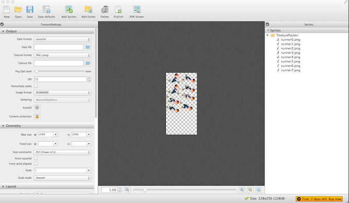
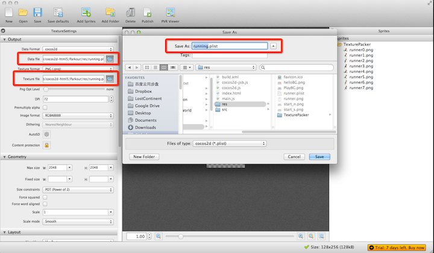
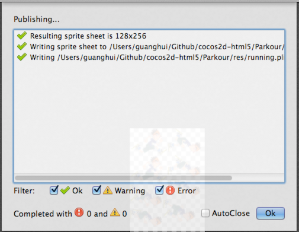
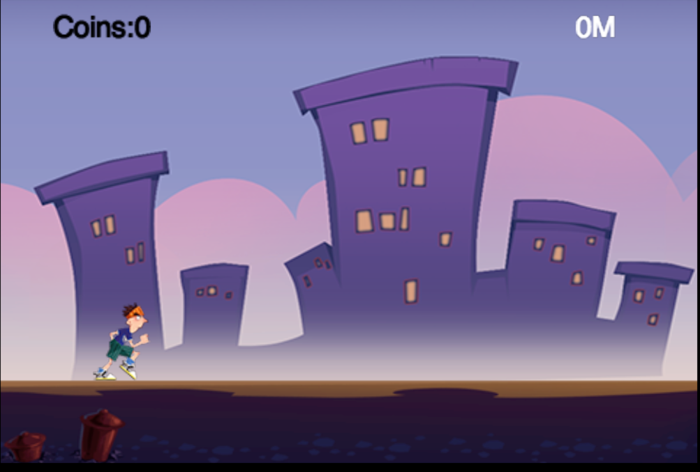

#让玩家运行动画

##介绍

在上篇指南中，我们实现了让玩家从一个点移动到另一个点的功能。但是这个移动有点怪异。在本篇指南中，我们将会向你展示如何让玩家运行动画。这样玩家的移动就会更加的逼真。

在开始具体的展示之前，请允许我给你展示一款特别酷的工具--**TexturePacker**

##TexturePacker的介绍

**TexturePacker**是一款可以使用图形用户界面和命令行来创建精灵表的工具。如果你想了解更多关于**TexturePacker**的知识，可以访问<a href="http://www.codeandweb.com/texturepacker/documentation">此网站</a>。

这里我会向你简要的介绍一下怎么样使用**TexturePacker**生成我们游戏中需要的动画文件。

###用TexturePacker生成你自己的动画

下面是生成的过程：

1.打开**TexturePacker**，把*res/TexturePacker*里面的 *TexturePacker*文件夹拖到**TexturePacker**中的精灵区中。

当你向*TexturePacker*文件夹中添加新的图片资源的时候，**TexturePacker**会检测到发生的改变并自动的加载图片资源。

2.在纹理设置面板（TextureSettings panel）中，把数据格式设成导出为“cocos2d”和“png”。

3.制定数据文件和纹理文件的路径。这里我们把路径设置成*res*目录，把数据文件名设成“running.plist”,把纹理文件名设成“running.png”。

4.点击“生成”，然后弹出一个对话框。如果没有错误的话，就会在制定的文件下生成"running.png" 和 "running.plist"文件。

到此，我们已经生成了动画文件，下面就让我们播放生成的动画。

##在cocos2d-JS中加载动画资源文件

###准备阶段

首先，我们应该把“running.plist” 和 “running.png”添加到 *resource.js*文件中。

    var res = {
    helloBG_png : "res/helloBG.png",
    start_n_png : "res/start_n.png",
    start_s_png : "res/start_s.png",
    PlayBG_png  : "res/PlayBG.png",
    runner_png  : "res/running.png",
    runner_plist : "res/running.plist"
    };
    
    var g_resources = [
    //image
    res.helloBG_png,
    res.start_n_png,
    res.start_s_png,
    res.PlayBG_png,
    res.runner_png,
    res.runner_plist
    ];
这里我们把变量 *runner_ png* 的值置成精灵表的文件名"running.png"。稍后，我们会用变量 *runner_png* 来创建我们的玩家精灵。

###创建玩家动画

首先，我们应该在文件*AnimationLayer.js*中添加下面的成员变量：

    spriteSheet:null,
    runningAction:null,
    sprite:null,
    
然后，我们用下面的内容替换玩家的创建方法：

    this.sprite = cc.Sprite.create("#runner0.png");

我们可以用下面的代码很轻松的创建一个动画：

    //1.加载精灵表
     cc.spriteFrameCache.addSpriteFrames(res.runner_plist);
    
    //2.创建精灵帧数组
    var animFrames = [];
    for (var i = 0; i < 8; i++) {
    var str = "runner" + i + ".png";
    var frame = cc.spriteFrameCache.getSpriteFrame(str);
    animFrames.push(frame);
    }
	//3.用精灵帧数组和一定的时间间隔创建一个动画
    var animation = cc.Animation.create(animFrames, 0.1);
    
	//4.用一个重复持续动作封装这个精灵动作
    this.runningAction = cc.RepeatForever.create(cc.Animate.create(animation));

这个动画是用精灵表中一系列小的图片（从runner0.png到runner7.png）构造出来的。

下面是在cocos2d-JS中创建一个动画的完整的处理过程：

1.往SpriteFrameCache类中加载精灵表的plist文件。

2.往数组*animFrames*中添加动画帧。

3.用动画帧数组和表示每两个精灵帧之间的时间间隔来创建一个**cc.Animation**的对象。

4.创建最终的**cc.Animate**对象，并用一个重复的持续性动作封装起来。

这样这个动画就会一直运动下去。

一般来说，如果我们在cocos2d-JS中使用动画，我们经常会用*SpriteBatchNode*来提高在WebGL模式或cocos2d-X JSB模式下的游戏性能。

*AnimationLayer.js*文件中的最终代码如下：

    var AnimationLayer = cc.Layer.extend({
    spriteSheet:null,
    runningAction:null,
    sprite:null,
    ctor:function () {
    this._super();
    this.init();
    },
    
    init:function () {
    this._super();
    
    // create sprite sheet
    cc.spriteFrameCache.addSpriteFrames(res.runner_plist);
    this.spriteSheet = cc.SpriteBatchNode.create(res.runner_png);
    this.addChild(this.spriteSheet);
    
    
    // init runningAction
    var animFrames = [];
    for (var i = 0; i < 8; i++) {
    var str = "runner" + i + ".png";
    var frame = cc.spriteFrameCache.getSpriteFrame(str);
    animFrames.push(frame);
    }
    
    var animation = cc.Animation.create(animFrames, 0.1);
    this.runningAction = cc.RepeatForever.create(cc.Animate.create(animation));
    this.sprite = cc.Sprite.create("#runner0.png");
    this.sprite.attr({x:80, y:85});
    this.sprite.runAction(this.runningAction);
    this.spriteSheet.addChild(this.sprite);
    }
    });

现在，你可以运行这个项目，将会有一个一直跑动的玩家显示的你的屏幕上。

##总结

在这篇指南中，我们学习了怎么样使用**TexturePacker**生成动画文件以及怎么样在cocos2d-JS中让玩家运行动画。

你可以从[这里](res/Parkour.zip)现在这个完整的项目。

##学习方向

在下篇指南中，我们将会往我们的物理世界中添加**chipmunk**物理引擎。到那时，我们的游戏将会更加的逼真。
